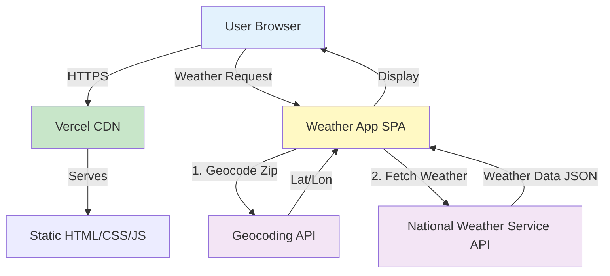
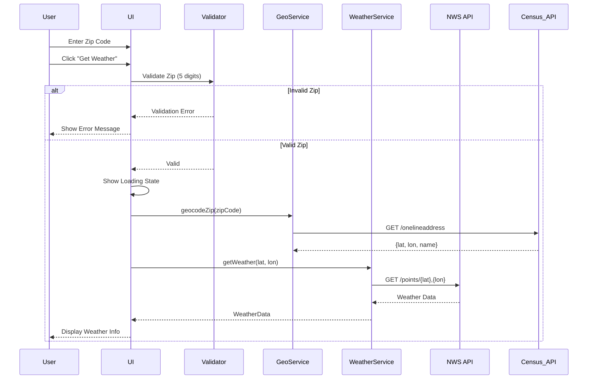
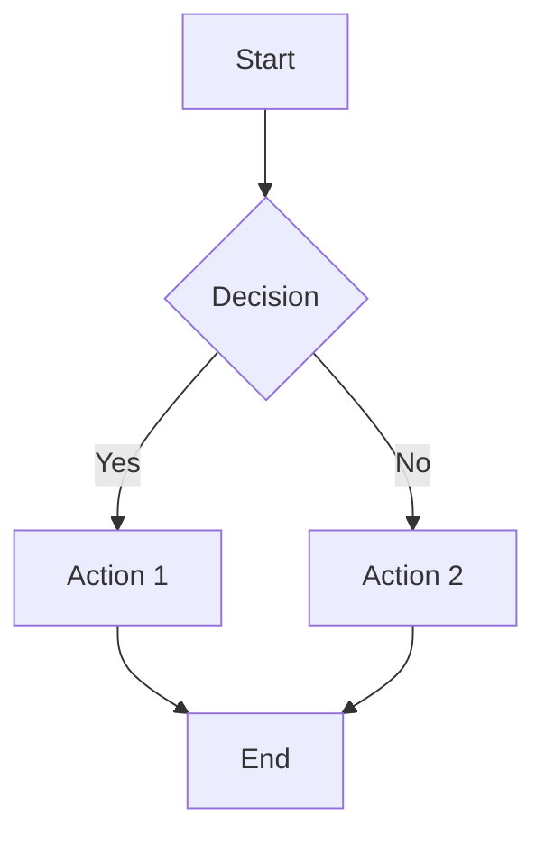
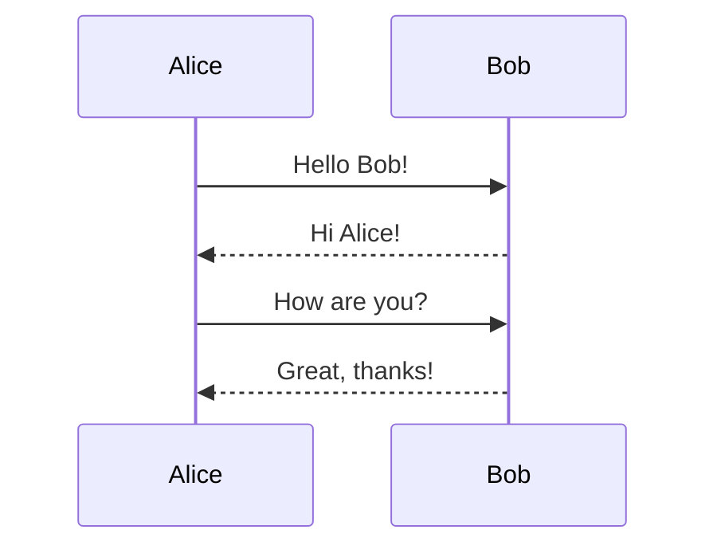

# How to View Mermaid Diagrams

## 🎨 What Are Mermaid Diagrams?

Mermaid is a text-based diagramming tool used throughout this project's architecture documents. Instead of creating diagrams in external tools, we write simple code that generates professional diagrams automatically.

## 📊 Diagrams in This Project

### 1. High-Level Architecture Diagram
**Location:** `docs/architecture/high-level-architecture.md`

Shows the overall system architecture - how the browser, CDN, app, and APIs interact.

### 2. Weather Lookup Flow
**Location:** `docs/architecture/core-workflows.md`

Sequence diagram showing exactly what happens when a user enters a zip code.

### 3. Error Handling Flow
**Location:** `docs/architecture/core-workflows.md`

Shows how different error scenarios are handled.

## 👁️ How to View the Diagrams

### Method 1: In VS Code / Cursor (Best Experience)

1. **Install Extension:**
   - Open Extensions panel (`Cmd+Shift+X` or `Ctrl+Shift+X`)
   - Search: **"Markdown Preview Mermaid Support"**
   - Install the extension by Matt Bierner

2. **View Diagrams:**
   - Open any architecture markdown file (e.g., `docs/architecture/high-level-architecture.md`)
   - Right-click the file tab → **"Open Preview"**
   - OR press `Cmd+Shift+V` (Mac) or `Ctrl+Shift+V` (Windows)
   - Diagrams will render beautifully!

### Method 2: Mermaid Live Editor (Online - No Installation)

Visit: **https://mermaid.live**

1. Copy the Mermaid code from any architecture file (between the ```mermaid markers)
2. Paste it into the Mermaid Live Editor
3. See the diagram instantly!
4. You can also export as PNG/SVG

### Method 3: GitHub (If You Push to GitHub)

GitHub automatically renders Mermaid diagrams in markdown files!

### Method 4: Using the Mermaid CLI (Advanced)

```bash
# Install Mermaid CLI
npm install -g @mermaid-js/mermaid-cli

# Convert diagram to image
mmdc -i docs/architecture/high-level-architecture.md -o diagram.png
```

## 🎯 Example: Try This Now!

### High-Level Architecture



**Try it:**
1. Copy the code block above
2. Go to https://mermaid.live
3. Paste and see your architecture visualized!

### Weather Lookup Sequence Diagram



## 📚 Learning Mermaid Syntax

### Basic Graph Syntax:


### Basic Sequence Diagram:


## 🔗 Resources

- **Mermaid Live Editor:** https://mermaid.live
- **Mermaid Documentation:** https://mermaid.js.org
- **Quick Reference:** https://mermaid.js.org/intro/syntax-reference.html
- **Examples Gallery:** https://mermaid.js.org/ecosystem/integrations.html

## 💡 Why BMAD Uses Mermaid

1. **Version Control** - Diagrams are text, so git tracks changes
2. **AI-Friendly** - AI agents can easily create/modify diagrams
3. **No External Tools** - No need for Visio, Lucidchart, draw.io
4. **Always Current** - Easy to update as architecture evolves
5. **Professional Output** - Generates beautiful, consistent diagrams
6. **Free & Open Source** - No licensing costs

---

**Quick Start:** Open this file in VS Code/Cursor with the Mermaid extension, press `Cmd+Shift+V`, and see all the diagrams render!

