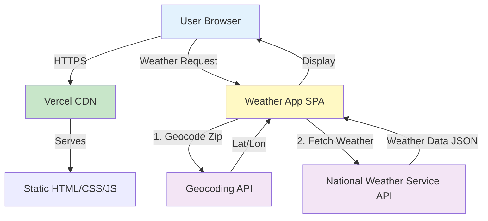
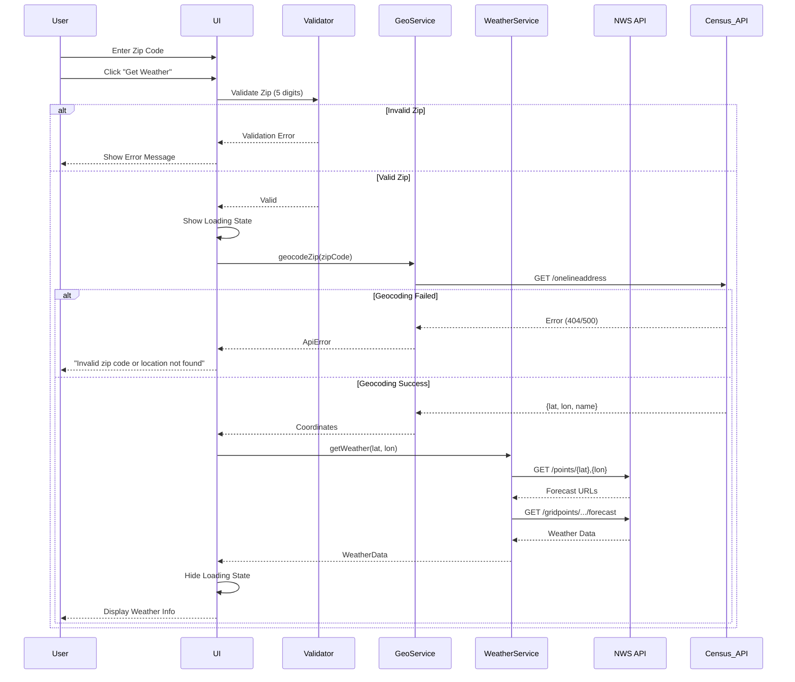
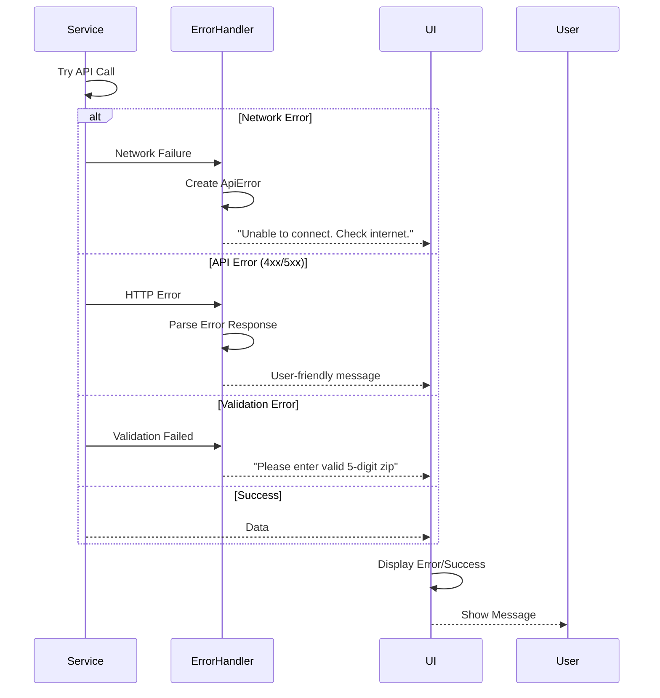
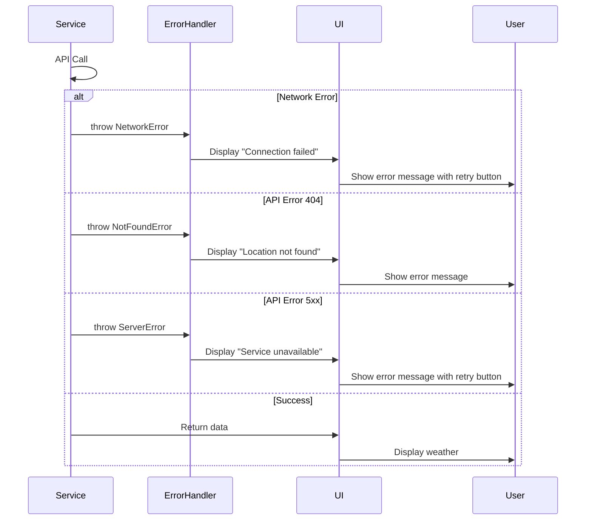

# Weather App by Zip Code - Architecture Document

## Introduction

This document outlines the complete architecture for the Weather App, a simple single-page application that fetches and displays weather data based on user-provided zip codes. The application leverages free, public weather APIs and is designed for rapid development and deployment without requiring a custom backend server.

### Starter Template

**N/A - Greenfield project** using Vite as the build tool for fast development and optimized production builds.

### Change Log

| Date | Version | Description | Author |
|------|---------|-------------|--------|
| 2025-10-16 | 1.0 | Initial architecture creation | Architect (BMAD) |

## High Level Architecture

### Technical Summary

The Weather App is built as a static single-page application using vanilla JavaScript (or React if preferred) with Vite as the modern build tool. The frontend makes direct API calls to the National Weather Service API (weather.gov), which is free and requires no API key for US weather data. The application will be deployed to Vercel or Netlify for free static hosting with automatic HTTPS and CDN distribution. This architecture prioritizes simplicity, zero operating costs, and fast development while delivering all required functionality.

### Platform and Infrastructure Choice

**Platform:** Vercel (Primary) / Netlify (Alternative)

**Key Services:**
- **Hosting:** Vercel Edge Network (global CDN)
- **Build:** Vercel Build System (automatic CI/CD on git push)
- **Domain:** Vercel provided subdomain (e.g., weather-app.vercel.app)
- **HTTPS:** Automatic SSL certificate
- **Analytics:** Vercel Analytics (optional)

**Deployment Regions:** Global CDN - edge locations worldwide

**Rationale:** Vercel offers zero-config deployment for static sites, automatic HTTPS, global CDN, and generous free tier. Perfect for this simple application with no backend requirements.

### Repository Structure

**Structure:** Single Repository (Monorepo not needed for simple app)

**Monorepo Tool:** N/A

**Package Organization:** Single package with standard frontend structure (src/, public/, tests/)

### High Level Architecture Diagram



### Architectural Patterns

- **Static Site Architecture:** No server-side processing - pure client-side application served via CDN - _Rationale:_ Simplest deployment model with excellent performance and zero server costs
- **API Client Pattern:** Centralized API service layer for external calls - _Rationale:_ Separates data fetching logic from UI components for testability and reusability
- **Component-Based UI:** Modular UI components (if using framework) or clean separation of concerns (vanilla JS) - _Rationale:_ Maintainable code structure that's easy to test and extend
- **Progressive Enhancement:** Core functionality works without JavaScript frameworks - _Rationale:_ Ensures basic accessibility and performance
- **Error-First Design:** Comprehensive error handling for all API calls and user inputs - _Rationale:_ Critical for good UX when dealing with external APIs

## Tech Stack

### Technology Stack Table

| Category | Technology | Version | Purpose | Rationale |
|----------|-----------|---------|---------|-----------|
| Build Tool | Vite | ^5.0 | Development server and production bundler | Lightning-fast HMR, optimized builds, zero config |
| Frontend Language | JavaScript/TypeScript | ES2022/TS 5.x | Application logic | Modern JS features, optional type safety with TypeScript |
| Frontend Framework | Vanilla JS (or React) | Latest / ^18.2 | UI rendering and state management | Keeps bundle small; React optional if team prefers |
| CSS Framework | Tailwind CSS | ^3.4 | Styling and responsive design | Utility-first, rapid UI development, small production bundle |
| HTTP Client | Fetch API | Native | API requests | Built-in, no dependencies needed |
| Testing Framework | Vitest | ^1.0 | Unit and integration testing | Native Vite integration, Jest-compatible API |
| E2E Testing | Playwright | ^1.40 | End-to-end testing | Fast, reliable, multi-browser support |
| Linting | ESLint | ^8.5 | Code quality | Standard JavaScript linting |
| Formatting | Prettier | ^3.1 | Code formatting | Consistent code style |
| Deployment Platform | Vercel | Latest | Static hosting and CDN | Zero-config, automatic deployments, free tier |
| CI/CD | GitHub Actions | Latest | Automated testing and deployment | Free for public repos, integrates with Vercel |
| Version Control | Git | Latest | Source control | Industry standard |

## External APIs

### National Weather Service API

- **Purpose:** Fetch current weather conditions, forecasts, and location data for US zip codes
- **Documentation:** https://www.weather.gov/documentation/services-web-api
- **Base URL(s):** `https://api.weather.gov`
- **Authentication:** None required (public API)
- **Rate Limits:** No strict limits, but requests should include User-Agent header as per API guidelines

**Key Endpoints Used:**
- `GET /points/{latitude},{longitude}` - Get forecast URLs for coordinates
- `GET /gridpoints/{office}/{gridX},{gridY}/forecast` - Get detailed forecast
- `GET /gridpoints/{office}/{gridX},{gridY}` - Get current conditions and observations

**Integration Notes:** The NWS API requires latitude/longitude coordinates, not zip codes directly. We'll need a geocoding solution:

### Geocoding Solution (Zip to Lat/Lon)

**Option 1 - US Census Geocoding API (Recommended):**
- **Purpose:** Convert US zip codes to latitude/longitude
- **Documentation:** https://geocoding.geo.census.gov/geocoder/
- **Base URL(s):** `https://geocoding.geo.census.gov/geocoder/locations/`
- **Authentication:** None required (public API)
- **Rate Limits:** Reasonable use policy, no strict limits
- **Key Endpoint:** `GET /onelineaddress?address={zipcode}&benchmark=2020&format=json`

**Option 2 - OpenStreetMap Nominatim (Fallback):**
- **Base URL:** `https://nominatim.openstreetmap.org/`
- **Authentication:** None, but requires User-Agent header
- **Rate Limits:** 1 request/second for free usage

## Data Models

### WeatherData Interface

**Purpose:** Represents the complete weather information displayed to the user

**Key Attributes:**
- location: string - City, State name
- zipCode: string - User-entered zip code
- temperature: number - Current temperature in Fahrenheit
- temperatureUnit: string - "F" or "C"
- conditions: string - Weather description (e.g., "Partly Cloudy")
- humidity: number - Humidity percentage
- windSpeed: number - Wind speed in mph
- windDirection: string - Wind direction (e.g., "NW")
- feelsLike: number - Feels-like temperature
- icon: string (optional) - Weather icon URL or identifier
- timestamp: Date - When data was fetched

#### TypeScript Interface

```typescript
interface WeatherData {
  location: string;
  zipCode: string;
  temperature: number;
  temperatureUnit: string;
  conditions: string;
  humidity: number;
  windSpeed: number;
  windDirection: string;
  feelsLike: number;
  icon?: string;
  timestamp: Date;
}
```

#### Relationships

- No database relationships (client-side only)
- Could be cached in localStorage for recent searches (future enhancement)

### Coordinates Interface

**Purpose:** Represents geographic coordinates obtained from geocoding service

**Key Attributes:**
- latitude: number - Latitude coordinate
- longitude: number - Longitude coordinate
- displayName: string - Formatted location name

#### TypeScript Interface

```typescript
interface Coordinates {
  latitude: number;
  longitude: number;
  displayName: string;
}
```

### ApiError Interface

**Purpose:** Standardized error information for user feedback

**Key Attributes:**
- message: string - User-friendly error message
- code: string - Error code for debugging
- details?: any - Additional error context

#### TypeScript Interface

```typescript
interface ApiError {
  message: string;
  code: string;
  details?: any;
}
```

## Core Workflows

### Weather Lookup Flow



### Error Handling Flow



## Project Structure

```plaintext
weather-app/
├── .github/
│   └── workflows/
│       ├── ci.yml                  # Run tests on PR
│       └── deploy.yml              # Deploy to Vercel on main
├── public/
│   ├── favicon.ico                 # App favicon
│   └── assets/                     # Static assets (icons, images)
├── src/
│   ├── main.ts                     # Application entry point
│   ├── index.html                  # HTML template
│   ├── styles/
│   │   ├── index.css               # Tailwind imports and global styles
│   │   └── components.css          # Component-specific styles
│   ├── services/
│   │   ├── geocoding.service.ts    # Geocoding API client
│   │   ├── weather.service.ts      # Weather API client
│   │   └── http.client.ts          # Shared HTTP utilities
│   ├── utils/
│   │   ├── validation.ts           # Input validation functions
│   │   ├── formatters.ts           # Data formatting utilities
│   │   └── error-handler.ts        # Error handling utilities
│   ├── types/
│   │   ├── weather.types.ts        # WeatherData interface
│   │   ├── coordinates.types.ts    # Coordinates interface
│   │   └── api.types.ts            # API response types
│   └── components/                 # UI components (if using React)
│       ├── WeatherForm.tsx
│       ├── WeatherDisplay.tsx
│       ├── LoadingSpinner.tsx
│       └── ErrorMessage.tsx
├── tests/
│   ├── unit/
│   │   ├── services/
│   │   │   ├── geocoding.service.test.ts
│   │   │   └── weather.service.test.ts
│   │   └── utils/
│   │       ├── validation.test.ts
│   │       └── formatters.test.ts
│   ├── integration/
│   │   └── weather-flow.test.ts
│   └── e2e/
│       └── weather-app.spec.ts
├── .env.example                    # Environment variables template
├── .gitignore                      # Git ignore rules
├── .eslintrc.js                    # ESLint configuration
├── .prettierrc                     # Prettier configuration
├── index.html                      # Entry HTML (Vite convention)
├── package.json                    # Dependencies and scripts
├── tsconfig.json                   # TypeScript configuration
├── tailwind.config.js              # Tailwind CSS configuration
├── postcss.config.js               # PostCSS configuration
├── vite.config.ts                  # Vite configuration
├── playwright.config.ts            # Playwright E2E config
├── vitest.config.ts                # Vitest testing config
└── README.md                       # Project documentation
```

## Development Workflow

### Local Development Setup

#### Prerequisites

```bash
# Required: Node.js 18+ and npm 9+
node --version  # Should be 18.x or higher
npm --version   # Should be 9.x or higher

# Optional: VS Code with extensions
# - ESLint
# - Prettier
# - Tailwind CSS IntelliSense
```

#### Initial Setup

```bash
# Clone repository
git clone <repository-url>
cd weather-app

# Install dependencies
npm install

# Copy environment template (if needed)
cp .env.example .env

# Start development server
npm run dev
```

#### Development Commands

```bash
# Start development server (http://localhost:5173)
npm run dev

# Run unit and integration tests
npm run test

# Run tests in watch mode
npm run test:watch

# Run E2E tests
npm run test:e2e

# Build for production
npm run build

# Preview production build locally
npm run preview

# Lint code
npm run lint

# Format code
npm run format

# Type check (TypeScript)
npm run type-check
```

### Environment Configuration

#### Required Environment Variables

```bash
# .env.local (for local development)
# No environment variables required for basic functionality
# NWS and Census APIs are public and don't need keys

# Optional: For enhanced features
# VITE_ENABLE_ANALYTICS=true
# VITE_ERROR_TRACKING_DSN=<sentry-dsn>
```

## Deployment Architecture

### Deployment Strategy

**Frontend Deployment:**
- **Platform:** Vercel
- **Build Command:** `npm run build`
- **Output Directory:** `dist`
- **CDN/Edge:** Vercel Edge Network (automatic)
- **Deployment Trigger:** Git push to `main` branch

**Deployment Steps:**
1. Push code to GitHub repository
2. Vercel automatically detects changes
3. Runs build command
4. Deploys to edge network
5. Provides deployment URL

### CI/CD Pipeline

```yaml
# .github/workflows/ci.yml
name: CI Pipeline

on:
  pull_request:
    branches: [main]
  push:
    branches: [main]

jobs:
  test:
    runs-on: ubuntu-latest
    steps:
      - uses: actions/checkout@v4
      - uses: actions/setup-node@v4
        with:
          node-version: '20'
          cache: 'npm'
      - run: npm ci
      - run: npm run lint
      - run: npm run type-check
      - run: npm run test
      - run: npm run build
```

### Environments

| Environment | Frontend URL | Purpose |
|-------------|--------------|---------|
| Development | http://localhost:5173 | Local development |
| Preview | https://weather-app-<hash>.vercel.app | PR preview deployments |
| Production | https://weather-app.vercel.app | Live environment |

## Security and Performance

### Security Requirements

**Frontend Security:**
- **CSP Headers:** `default-src 'self'; connect-src 'self' https://api.weather.gov https://geocoding.geo.census.gov; img-src 'self' data: https:;`
- **XSS Prevention:** Input sanitization for all user inputs, Content Security Policy enforced
- **Secure Storage:** No sensitive data stored; localStorage only for non-sensitive cache (future enhancement)
- **HTTPS Only:** All API calls over HTTPS, app served via HTTPS (automatic with Vercel)

**API Security:**
- **User-Agent Header:** Required by NWS API - set to descriptive value with contact info
- **Rate Limiting:** Client-side throttling to respect API usage guidelines
- **Input Validation:** Strict validation of zip code format before API calls
- **Error Handling:** No sensitive information exposed in error messages

### Performance Optimization

**Frontend Performance:**
- **Bundle Size Target:** < 100KB initial JS bundle (gzipped)
- **Loading Strategy:** Code splitting for non-critical features, lazy loading for future enhancements
- **Caching Strategy:** HTTP caching headers for static assets, service worker for offline support (optional)
- **Image Optimization:** Vite automatic image optimization, WebP format with fallbacks

**API Performance:**
- **Response Time Target:** < 2 seconds for complete weather lookup
- **Request Optimization:** Parallel geocoding and weather requests where possible
- **Caching Strategy:** Cache weather data client-side for 15 minutes to reduce API calls
- **Error Recovery:** Exponential backoff for retries, fallback geocoding service

## Testing Strategy

### Testing Pyramid

```plaintext
        E2E Tests (5%)
       /              \
    Integration (15%)
   /                  \
  Unit Tests (80%)
```

### Test Organization

#### Unit Tests

```plaintext
tests/unit/
├── services/
│   ├── geocoding.service.test.ts    # Test geocoding API calls
│   └── weather.service.test.ts      # Test weather API calls
└── utils/
    ├── validation.test.ts           # Test zip code validation
    └── formatters.test.ts           # Test data formatting
```

#### Integration Tests

```plaintext
tests/integration/
└── weather-flow.test.ts             # Test complete weather lookup flow
```

#### E2E Tests

```plaintext
tests/e2e/
└── weather-app.spec.ts              # Test user journey end-to-end
```

### Test Examples

#### Unit Test Example

```typescript
// tests/unit/utils/validation.test.ts
import { describe, it, expect } from 'vitest';
import { validateZipCode } from '@/utils/validation';

describe('validateZipCode', () => {
  it('should return true for valid 5-digit zip code', () => {
    expect(validateZipCode('12345')).toBe(true);
    expect(validateZipCode('90210')).toBe(true);
  });

  it('should return false for invalid zip codes', () => {
    expect(validateZipCode('1234')).toBe(false);    // Too short
    expect(validateZipCode('123456')).toBe(false);  // Too long
    expect(validateZipCode('abcde')).toBe(false);   // Not numeric
    expect(validateZipCode('')).toBe(false);        // Empty
  });
});
```

#### Integration Test Example

```typescript
// tests/integration/weather-flow.test.ts
import { describe, it, expect, vi } from 'vitest';
import { getWeatherByZipCode } from '@/services/weather.service';

describe('Weather Lookup Flow', () => {
  it('should fetch weather data for valid zip code', async () => {
    const zipCode = '10001'; // NYC
    const result = await getWeatherByZipCode(zipCode);

    expect(result).toBeDefined();
    expect(result.location).toContain('New York');
    expect(result.temperature).toBeTypeOf('number');
    expect(result.conditions).toBeTypeOf('string');
  });

  it('should throw error for invalid zip code', async () => {
    await expect(getWeatherByZipCode('00000')).rejects.toThrow();
  });
});
```

#### E2E Test Example

```typescript
// tests/e2e/weather-app.spec.ts
import { test, expect } from '@playwright/test';

test('user can search weather by zip code', async ({ page }) => {
  await page.goto('http://localhost:5173');

  // Enter zip code
  const input = page.locator('input[placeholder*="ZIP"]');
  await input.fill('10001');

  // Click submit button
  const submitButton = page.locator('button:has-text("Get Weather")');
  await submitButton.click();

  // Wait for results
  await page.waitForSelector('[data-testid="weather-results"]', { timeout: 5000 });

  // Verify weather data is displayed
  const location = page.locator('[data-testid="location"]');
  await expect(location).toContainText('New York');

  const temperature = page.locator('[data-testid="temperature"]');
  await expect(temperature).toBeVisible();
});

test('user sees error for invalid zip code', async ({ page }) => {
  await page.goto('http://localhost:5173');

  const input = page.locator('input[placeholder*="ZIP"]');
  await input.fill('999');

  const submitButton = page.locator('button:has-text("Get Weather")');
  await submitButton.click();

  // Verify error message
  const errorMessage = page.locator('[data-testid="error-message"]');
  await expect(errorMessage).toBeVisible();
  await expect(errorMessage).toContainText('valid 5-digit');
});
```

## Coding Standards

### Critical Rules

- **Service Layer for API Calls:** Never make direct fetch() calls from UI components - always use the service layer (`geocoding.service.ts`, `weather.service.ts`)
- **TypeScript Strict Mode:** Use strict TypeScript - all functions must have type annotations
- **Error Handling Required:** All async functions must have try-catch blocks with proper error handling
- **Component Data Attributes:** All interactive elements must have `data-testid` attributes for testing
- **No Hardcoded Values:** Use constants file for API URLs, timeout values, retry counts
- **Validation First:** Always validate user input before making API calls
- **User-Friendly Errors:** Never show raw API errors to users - transform to friendly messages

### Naming Conventions

| Element | Convention | Example |
|---------|-----------|---------|
| Files | kebab-case | `weather.service.ts` |
| Classes | PascalCase | `WeatherService` |
| Functions | camelCase | `getWeatherByZipCode()` |
| Constants | UPPER_SNAKE_CASE | `API_BASE_URL` |
| Types/Interfaces | PascalCase | `WeatherData` |
| CSS Classes | kebab-case | `weather-card` |

## Error Handling Strategy

### Error Flow



### Error Response Format

```typescript
interface ApiError {
  code: string;
  message: string;
  details?: any;
  timestamp: Date;
}

// Error codes
const ERROR_CODES = {
  NETWORK_ERROR: 'NETWORK_ERROR',
  INVALID_ZIP: 'INVALID_ZIP',
  LOCATION_NOT_FOUND: 'LOCATION_NOT_FOUND',
  API_ERROR: 'API_ERROR',
  RATE_LIMIT: 'RATE_LIMIT',
} as const;
```

### Frontend Error Handling

```typescript
// src/utils/error-handler.ts
export function handleApiError(error: unknown): ApiError {
  if (error instanceof TypeError && error.message.includes('fetch')) {
    return {
      code: ERROR_CODES.NETWORK_ERROR,
      message: 'Unable to connect. Please check your internet connection.',
      timestamp: new Date(),
    };
  }

  if (error instanceof Response) {
    if (error.status === 404) {
      return {
        code: ERROR_CODES.LOCATION_NOT_FOUND,
        message: 'Location not found. Please check your zip code.',
        timestamp: new Date(),
      };
    }
    if (error.status >= 500) {
      return {
        code: ERROR_CODES.API_ERROR,
        message: 'Weather service is temporarily unavailable. Please try again later.',
        timestamp: new Date(),
      };
    }
  }

  return {
    code: ERROR_CODES.API_ERROR,
    message: 'An unexpected error occurred. Please try again.',
    details: error,
    timestamp: new Date(),
  };
}
```

## Monitoring and Observability

### Monitoring Stack

- **Frontend Monitoring:** Vercel Analytics (basic performance metrics)
- **Error Tracking:** Console logging for development; optional Sentry integration for production
- **Performance Monitoring:** Web Vitals tracking (LCP, FID, CLS)
- **User Analytics:** Optional Google Analytics or Plausible (privacy-focused)

### Key Metrics

**Frontend Metrics:**
- **Core Web Vitals:** LCP < 2.5s, FID < 100ms, CLS < 0.1
- **JavaScript errors:** Track unhandled exceptions
- **API response times:** Monitor geocoding and weather API latency
- **User interactions:** Track successful vs failed weather lookups

**API Health:**
- **Success rate:** % of successful weather lookups
- **Error rate:** % of failed API calls by error type
- **Response time:** Average time from zip code submission to display
- **User behavior:** Most searched zip codes, peak usage times

---

## Architecture Review Complete

This architecture document provides all the technical details needed for AI agents to implement the Weather App. The design prioritizes:

✅ **Simplicity** - No backend, no database, minimal dependencies  
✅ **Zero Cost** - Free APIs, free hosting, free CI/CD  
✅ **Fast Development** - Modern tools (Vite), clear structure, comprehensive types  
✅ **Production Ready** - Testing strategy, error handling, monitoring, security  
✅ **Maintainable** - Clear patterns, typed interfaces, documented decisions  

**Next Steps:** Run Product Owner (PO) agent to shard this architecture into implementable documents, then begin development with Scrum Master (SM) and Developer (Dev) agents.

