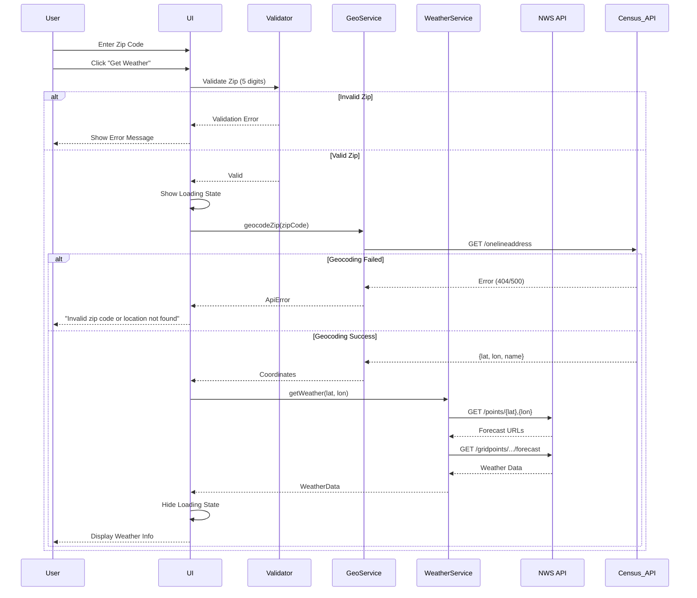
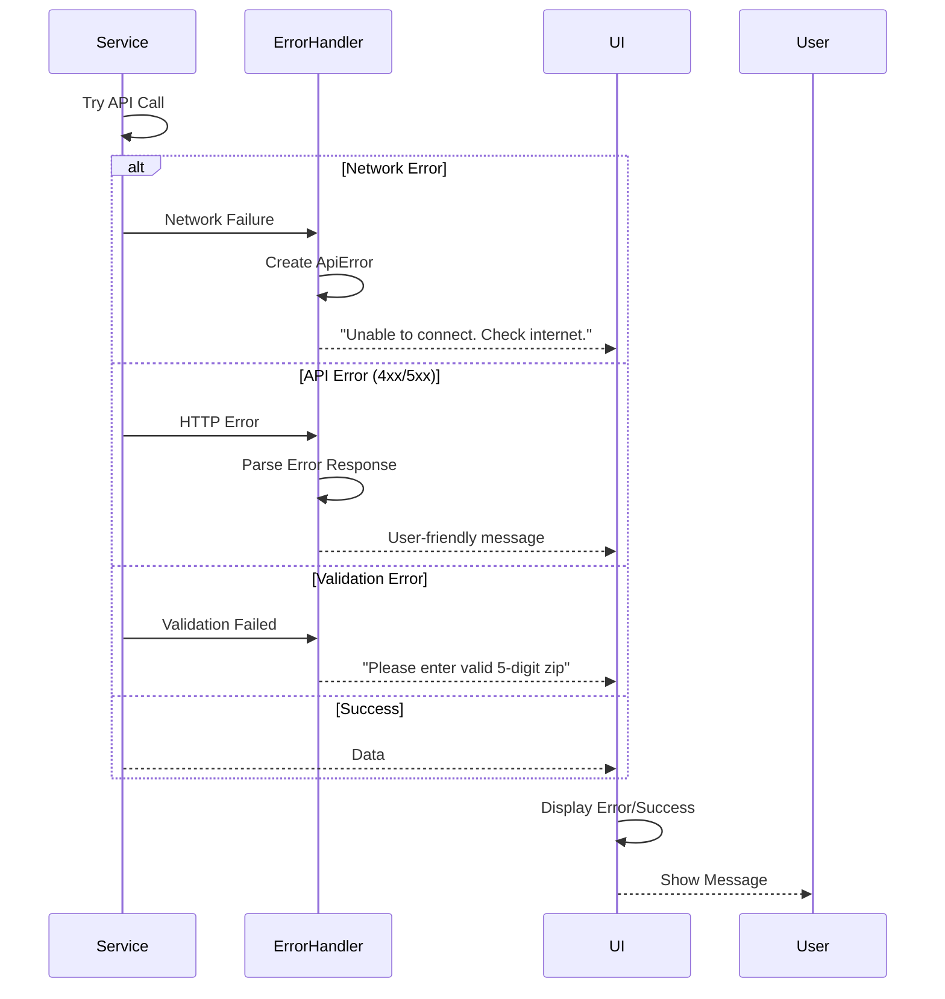

# Core Workflows

## Weather Lookup Flow

```mermaid
sequenceDiagram
    participant User
    participant UI
    participant Validator
    participant GeoService
    participant WeatherService
    participant NWS_API as NWS API
    
    User->>UI: Enter Zip Code
    User->>UI: Click "Get Weather"
    UI->>Validator: Validate Zip (5 digits)
    
    alt Invalid Zip
        Validator-->>UI: Validation Error
        UI-->>User: Show Error Message
    else Valid Zip
        Validator-->>UI: Valid
        UI->>UI: Show Loading State
        
        UI->>GeoService: geocodeZip(zipCode)
        GeoService->>Census_API: GET /onelineaddress
        
        alt Geocoding Failed
            Census_API-->>GeoService: Error (404/500)
            GeoService-->>UI: ApiError
            UI-->>User: "Invalid zip code or location not found"
        else Geocoding Success
            Census_API-->>GeoService: {lat, lon, name}
            GeoService-->>UI: Coordinates
            
            UI->>WeatherService: getWeather(lat, lon)
            WeatherService->>NWS_API: GET /points/{lat},{lon}
            NWS_API-->>WeatherService: Forecast URLs
            
            WeatherService->>NWS_API: GET /gridpoints/.../forecast
            NWS_API-->>WeatherService: Weather Data
            
            WeatherService-->>UI: WeatherData
            UI->>UI: Hide Loading State
            UI-->>User: Display Weather Info
        end
    end
```

## Error Handling Flow

```mermaid
sequenceDiagram
    participant Service
    participant ErrorHandler
    participant UI
    participant User
    
    Service->>Service: Try API Call
    
    alt Network Error
        Service->>ErrorHandler: Network Failure
        ErrorHandler->>ErrorHandler: Create ApiError
        ErrorHandler-->>UI: "Unable to connect. Check internet."
    else API Error (4xx/5xx)
        Service->>ErrorHandler: HTTP Error
        ErrorHandler->>ErrorHandler: Parse Error Response
        ErrorHandler-->>UI: User-friendly message
    else Validation Error
        Service->>ErrorHandler: Validation Failed
        ErrorHandler-->>UI: "Please enter valid 5-digit zip"
    else Success
        Service-->>UI: Data
    end
    
    UI->>UI: Display Error/Success
    UI-->>User: Show Message
```
