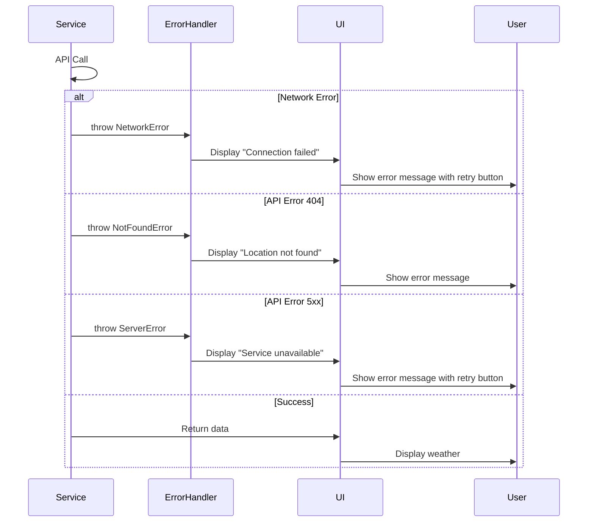

# Error Handling Strategy

## Error Flow



## Error Response Format

```typescript
interface ApiError {
  code: string;
  message: string;
  details?: any;
  timestamp: Date;
}

// Error codes
const ERROR_CODES = {
  NETWORK_ERROR: 'NETWORK_ERROR',
  INVALID_ZIP: 'INVALID_ZIP',
  LOCATION_NOT_FOUND: 'LOCATION_NOT_FOUND',
  API_ERROR: 'API_ERROR',
  RATE_LIMIT: 'RATE_LIMIT',
} as const;
```

## Frontend Error Handling

```typescript
// src/utils/error-handler.ts
export function handleApiError(error: unknown): ApiError {
  if (error instanceof TypeError && error.message.includes('fetch')) {
    return {
      code: ERROR_CODES.NETWORK_ERROR,
      message: 'Unable to connect. Please check your internet connection.',
      timestamp: new Date(),
    };
  }

  if (error instanceof Response) {
    if (error.status === 404) {
      return {
        code: ERROR_CODES.LOCATION_NOT_FOUND,
        message: 'Location not found. Please check your zip code.',
        timestamp: new Date(),
      };
    }
    if (error.status >= 500) {
      return {
        code: ERROR_CODES.API_ERROR,
        message: 'Weather service is temporarily unavailable. Please try again later.',
        timestamp: new Date(),
      };
    }
  }

  return {
    code: ERROR_CODES.API_ERROR,
    message: 'An unexpected error occurred. Please try again.',
    details: error,
    timestamp: new Date(),
  };
}
```
