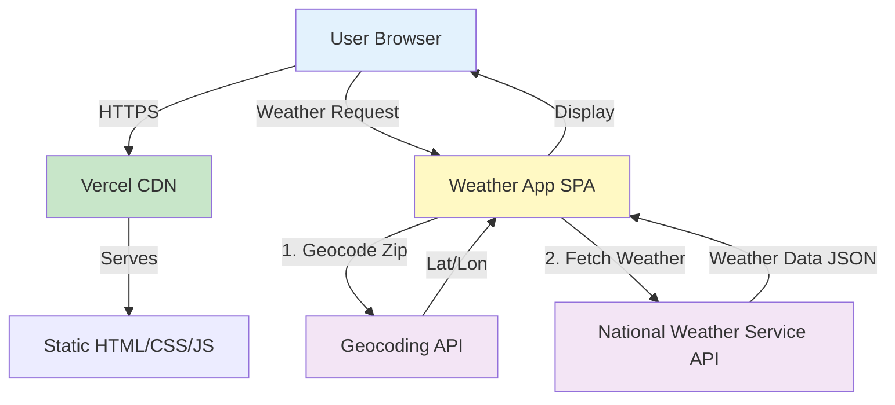

# High Level Architecture

## Technical Summary

The Weather App is built as a static single-page application using vanilla JavaScript (or React if preferred) with Vite as the modern build tool. The frontend makes direct API calls to the National Weather Service API (weather.gov), which is free and requires no API key for US weather data. The application will be deployed to Vercel or Netlify for free static hosting with automatic HTTPS and CDN distribution. This architecture prioritizes simplicity, zero operating costs, and fast development while delivering all required functionality.

## Platform and Infrastructure Choice

**Platform:** Vercel (Primary) / Netlify (Alternative)

**Key Services:**
- **Hosting:** Vercel Edge Network (global CDN)
- **Build:** Vercel Build System (automatic CI/CD on git push)
- **Domain:** Vercel provided subdomain (e.g., weather-app.vercel.app)
- **HTTPS:** Automatic SSL certificate
- **Analytics:** Vercel Analytics (optional)

**Deployment Regions:** Global CDN - edge locations worldwide

**Rationale:** Vercel offers zero-config deployment for static sites, automatic HTTPS, global CDN, and generous free tier. Perfect for this simple application with no backend requirements.

## Repository Structure

**Structure:** Single Repository (Monorepo not needed for simple app)

**Monorepo Tool:** N/A

**Package Organization:** Single package with standard frontend structure (src/, public/, tests/)

## High Level Architecture Diagram

## Architectural Patterns

- **Static Site Architecture:** No server-side processing - pure client-side application served via CDN - _Rationale:_ Simplest deployment model with excellent performance and zero server costs
- **API Client Pattern:** Centralized API service layer for external calls - _Rationale:_ Separates data fetching logic from UI components for testability and reusability
- **Component-Based UI:** Modular UI components (if using framework) or clean separation of concerns (vanilla JS) - _Rationale:_ Maintainable code structure that's easy to test and extend
- **Progressive Enhancement:** Core functionality works without JavaScript frameworks - _Rationale:_ Ensures basic accessibility and performance
- **Error-First Design:** Comprehensive error handling for all API calls and user inputs - _Rationale:_ Critical for good UX when dealing with external APIs
